<div align="center">

# LabTether

**Cross-platform homelab control plane with AI-powered operations.**

[](https://github.com/labtether/labtether/actions/workflows/ci.yml)
[](https://go.dev)
[](https://docs.docker.com/compose/)
[](LICENSE)
[](DISCORD_INVITE_URL)
[](https://demo.labtether.com)

[Website](https://labtether.com) &middot; [Docs](https://labtether.com/docs) &middot; [Wiki](https://labtether.com/docs/wiki) &middot; [Discord](DISCORD_INVITE_URL) &middot; [Demo](https://demo.labtether.com) &middot; [Changelog](CHANGELOG.md)

</div>

<p align="center">
  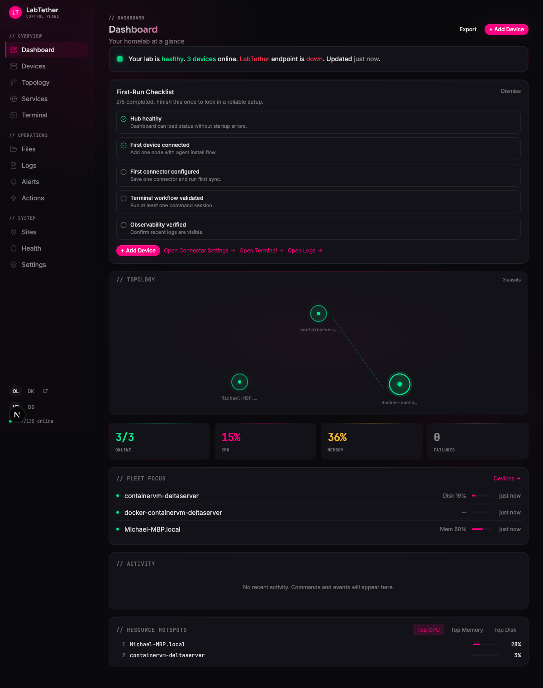
</p>

<p align="center">
  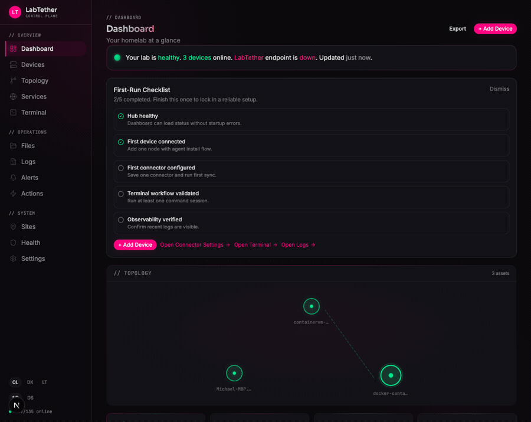
  <br/>
  <em>Dashboard &rarr; Devices &rarr; Topology &rarr; Terminal &rarr; Alerts &rarr; Files</em>
</p>

<table>
<tr>
<td align="center" width="33%">
<strong>Cross-Platform</strong><br/>
Linux, Windows, macOS, FreeBSD — all first-class citizens, managed from one hub.
</td>
<td align="center" width="33%">
<strong>AI Agent Gateway</strong><br/>
Operate your infrastructure through Claude, Cursor, or any MCP client.
</td>
<td align="center" width="33%">
<strong>Unified Operations</strong><br/>
Dashboard, remote access, alerts, updates — one URL instead of six tabs.
</td>
</tr>
</table>

---

## Why LabTether

You run Proxmox, TrueNAS, Docker, maybe Home Assistant. Each has its own dashboard, its own alerts, its own way of telling you something is wrong. When a drive starts failing at 2 AM, you're opening five tabs trying to piece together what happened.

LabTether replaces the tab sprawl with one dashboard, one timeline, one URL.

- **One dashboard** for metrics, logs, alerts, incidents, and actions -- no tab sprawl.
- **Multi-platform** -- manage Linux, Windows, macOS, and FreeBSD from one place.
- **Self-hosted** -- Docker Compose + Postgres. Your data never leaves your network.
- **Integrations** -- Proxmox, TrueNAS, Docker, Portainer, Home Assistant, and more.

---

## Quick Start

Get a full LabTether hub running in under 5 minutes. You need Docker.

**One command:**

```bash
docker run -d --name labtether \
  -p 3000:3000 -p 8443:8443 \
  -v labtether-data:/data \
  ghcr.io/labtether/labtether:latest
```

Open **http://localhost:3000** — the setup wizard walks you through the rest. TLS certificates are generated automatically.

> Full guide with Tailscale remote access, custom TLS, OIDC SSO, and multi-user setup at [labtether.com/docs](https://labtether.com/docs).

### Advanced: Docker Compose

For split services, external Postgres, or resource limits:

```bash
curl -fsSL https://raw.githubusercontent.com/labtether/labtether/main/deploy/compose/docker-compose.deploy.yml \
  -o docker-compose.yml
docker compose up -d
```

---

## Install Agents

Agents are optional -- connectors like Proxmox and TrueNAS work without them. Agents unlock deeper telemetry, remote terminal and desktop access, and action execution on your nodes.

### Linux

Download the agent binary from [Releases](https://github.com/labtether/labtether-agent/releases/latest) (amd64 or arm64), then enroll:

```bash
curl -fsSL https://github.com/labtether/labtether-agent/releases/latest/download/labtether-agent-linux-amd64 \
  -o /usr/local/bin/labtether-agent
chmod +x /usr/local/bin/labtether-agent
labtether-agent --hub wss://your-hub:8443/ws/agent --enrollment-token YOUR_TOKEN
```

Or use the hub's generated install command -- it handles the download automatically.

See the [Linux agent setup guide](https://labtether.com/docs/install-upgrade/agent-install-commands-by-os) for systemd installation and enrollment.

### macOS

Download **LabTether Agent.app** from [Releases](https://github.com/labtether/labtether-mac/releases/latest). Drag to Applications and launch -- the menu bar icon handles enrollment.

### Windows

Download **LabTether Agent** from [Releases](https://github.com/labtether/labtether-win/releases/latest) and run the installer. The system tray icon handles enrollment.

### FreeBSD

FreeBSD nodes are managed agentlessly via connectors. No agent install required.

> Agent docs: [labtether.com/docs/install-upgrade/agent-install-commands-by-os](https://labtether.com/docs/install-upgrade/agent-install-commands-by-os)

---

## What You Get

**Fleet Dashboard** -- Health at a glance. CPU, memory, disk, network, and temperature across every node.

**Remote Access** -- Terminal and desktop sessions directly from the browser. No SSH keys or VNC clients needed.

**Alerts and Incidents** -- Define rules, get notified, triage and resolve from one timeline with correlated telemetry.

**Integrations** -- Connect what you already run: Proxmox VE, TrueNAS, Docker, Portainer, Home Assistant, and Proxmox Backup Server.

**Update Runs** -- Plan and execute maintenance across your fleet with dry-run support and audit trails.

<details>
<summary><strong>Screenshots</strong></summary>
<br/>
<p align="center">
  <br/>
  <em>Fleet Dashboard — all nodes at a glance</em>
</p>
<p align="center">
  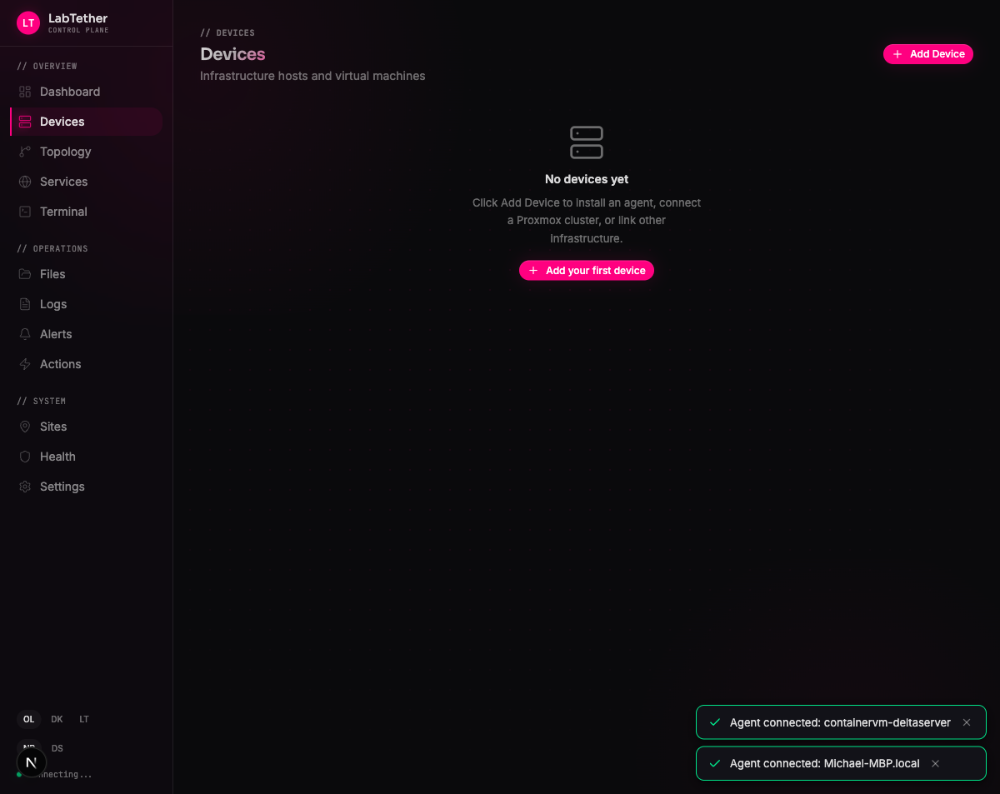<br/>
  <em>Device Detail — deep telemetry per host</em>
</p>
<p align="center">
  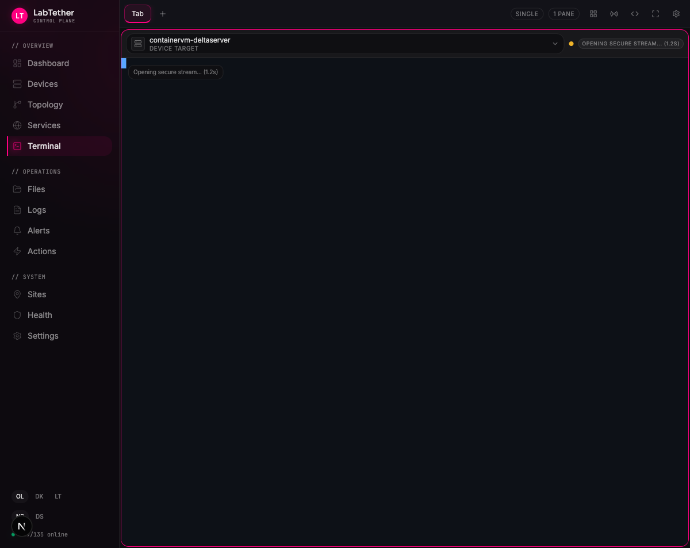<br/>
  <em>Remote Terminal — browser-based SSH, no keys needed</em>
</p>
<p align="center">
  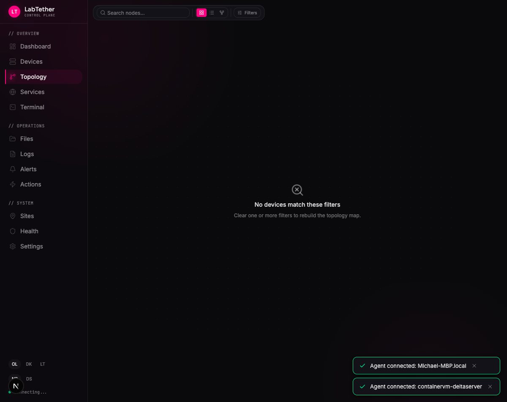<br/>
  <em>Topology Map — visualize your infrastructure</em>
</p>
<p align="center">
  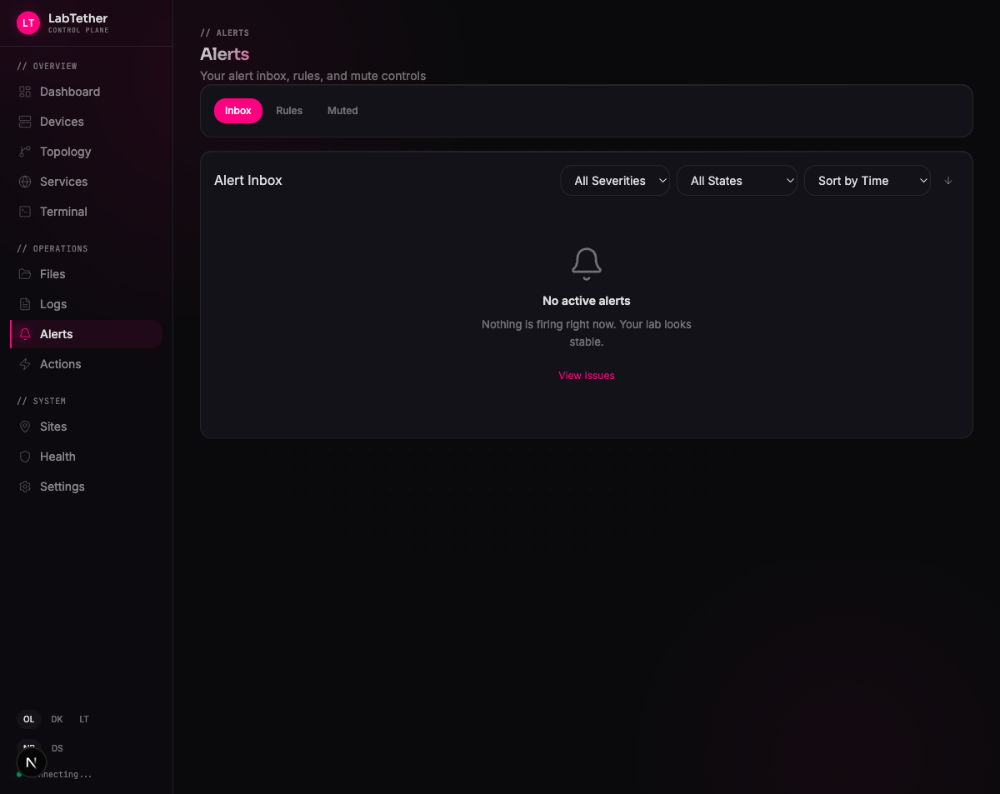<br/>
  <em>Alerts — correlated timeline with telemetry</em>
</p>
<p align="center">
  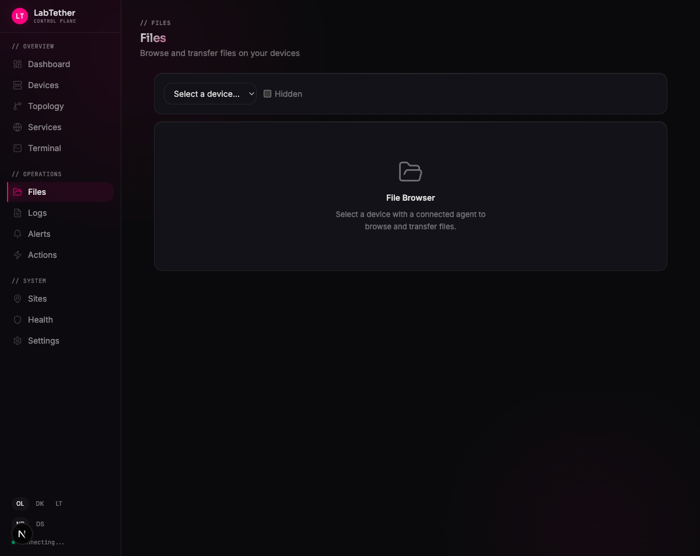<br/>
  <em>File Manager — browse and transfer files remotely</em>
</p>
<p align="center">
  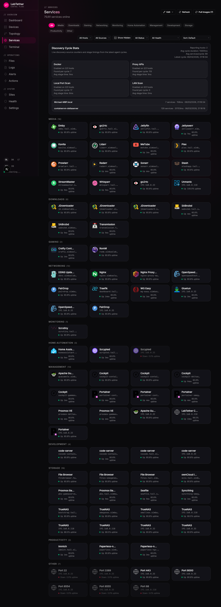<br/>
  <em>Services — monitor and manage running services</em>
</p>
<p align="center">
  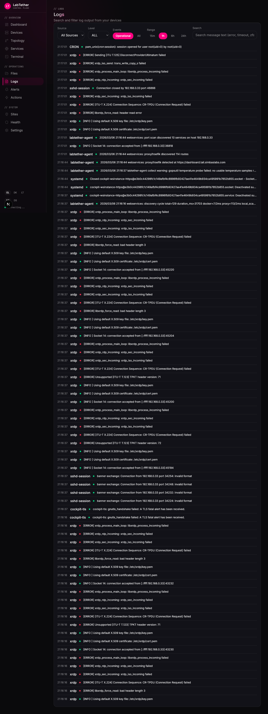<br/>
  <em>Logs — centralized log viewer with search and filtering</em>
</p>
<p align="center">
  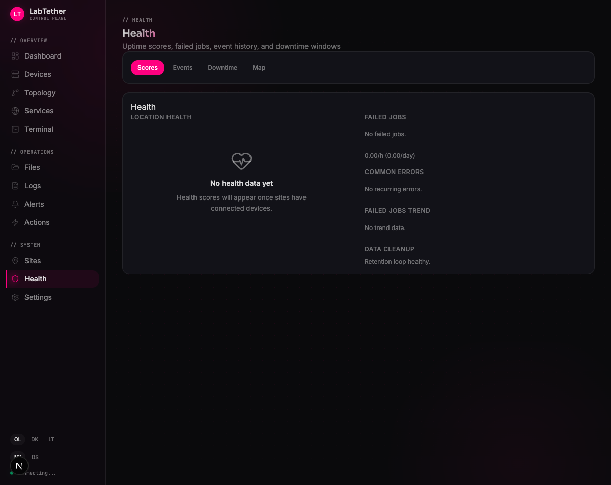<br/>
  <em>Health — system health checks at a glance</em>
</p>
<p align="center">
  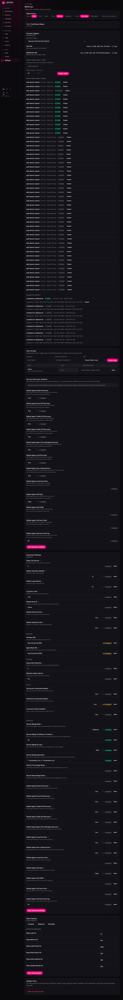<br/>
  <em>Settings — configure hub, integrations, and users</em>
</p>
<p align="center">
  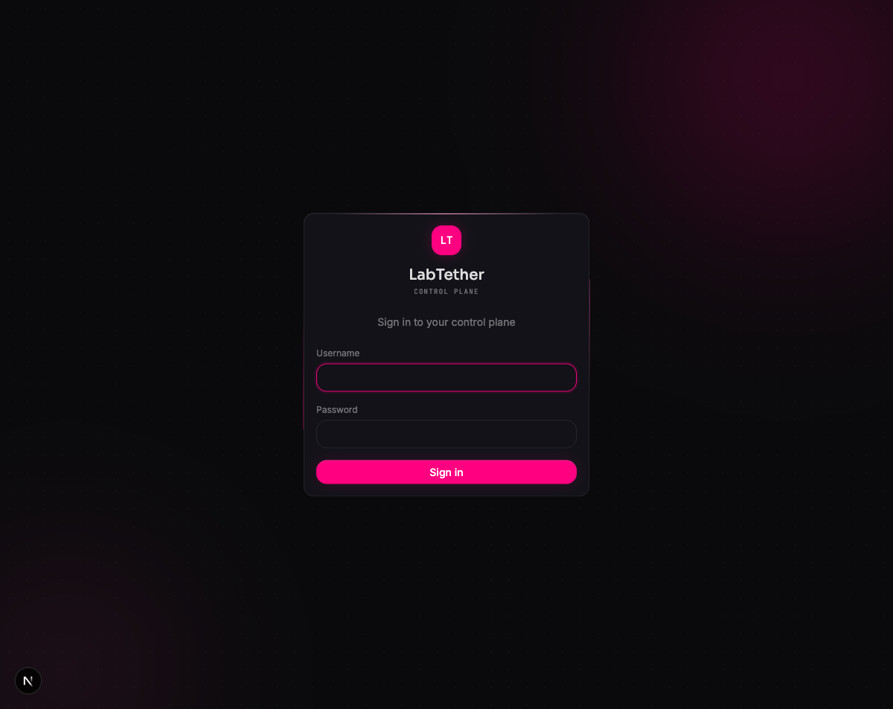<br/>
  <em>Login — secure authentication with SSO support</em>
</p>
</details>

---

## Supported Integrations

<p align="center">
  
  
  
  
  
  
</p>

---

## Ecosystem

| | Platform | Description |
|:---|:---------|:------------|
| **[Linux Agent](https://github.com/labtether/labtether-agent)** | Linux | Telemetry, remote access, and actions for Linux machines. |
| **[CLI](https://github.com/labtether/labtether-cli)** | Cross-platform | Manage your hub from the terminal. |

### Coming soon

| | Platform | Description |
|:---|:---------|:------------|
| **[Windows Agent](https://github.com/labtether/labtether-win)** | Windows 10+ | Native system tray app with service management and auto-updates. |
| **[macOS Agent](https://github.com/labtether/labtether-mac)** | macOS 13+ | Menu bar app with status, enrollment, and notifications. |
| **FreeBSD Agent** | FreeBSD 13+ | Endpoint agent for BSD-based systems. |
| **iOS & iPad Companion** | iPhone / iPad | Mobile fleet monitoring, push notifications, and live activities. One-time purchase, no subscriptions. |

---

## Community

- **Discord** -- [Join the server](DISCORD_INVITE_URL)
- **Twitter/X** -- [@labtether](https://x.com/labtether) &middot; [@Watari_Labs_](https://x.com/Watari_Labs_)
- **Blog** -- [labtether.com/blog](https://labtether.com/blog)
- **Live Demo** -- [demo.labtether.com](https://demo.labtether.com) (no signup required)

---

## Documentation

- **User Guide and Wiki** -- [labtether.com/docs](https://labtether.com/docs)
- **Changelog** -- [CHANGELOG.md](CHANGELOG.md)
- **Contributing** -- [CONTRIBUTING.md](CONTRIBUTING.md)
- **Security** -- [SECURITY.md](SECURITY.md)
- **License** -- [Apache 2.0](LICENSE)

---

<div align="center">

Copyright 2026 LabTether. [Apache 2.0](LICENSE)

</div>
